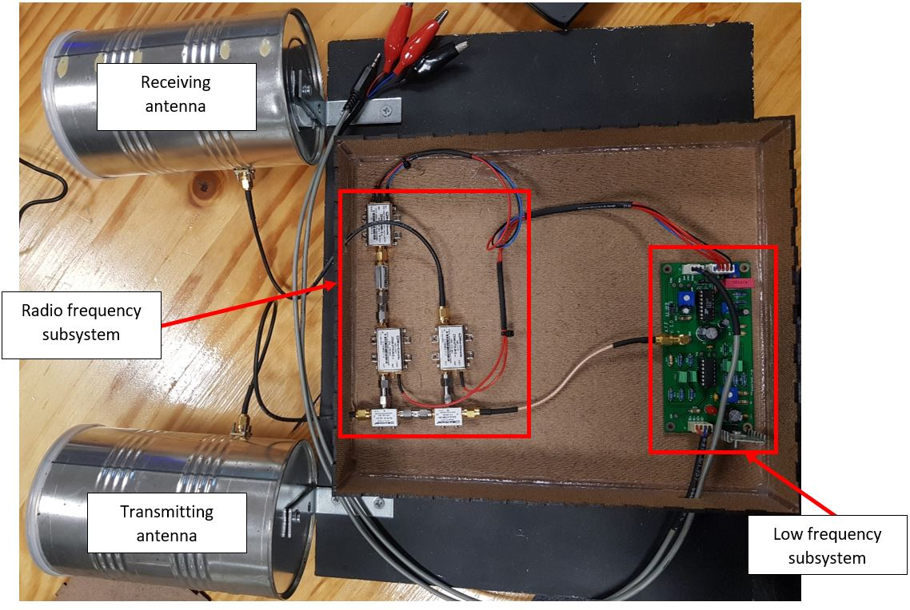
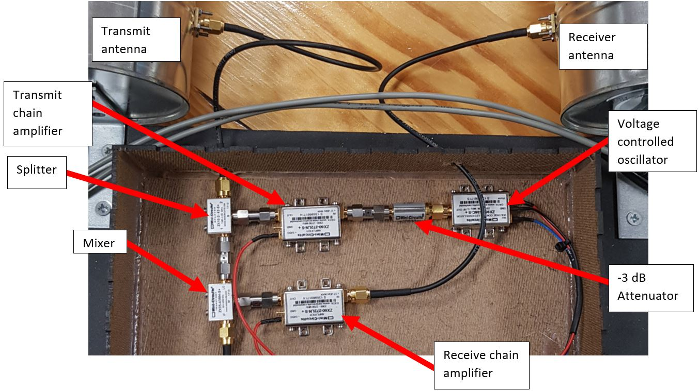
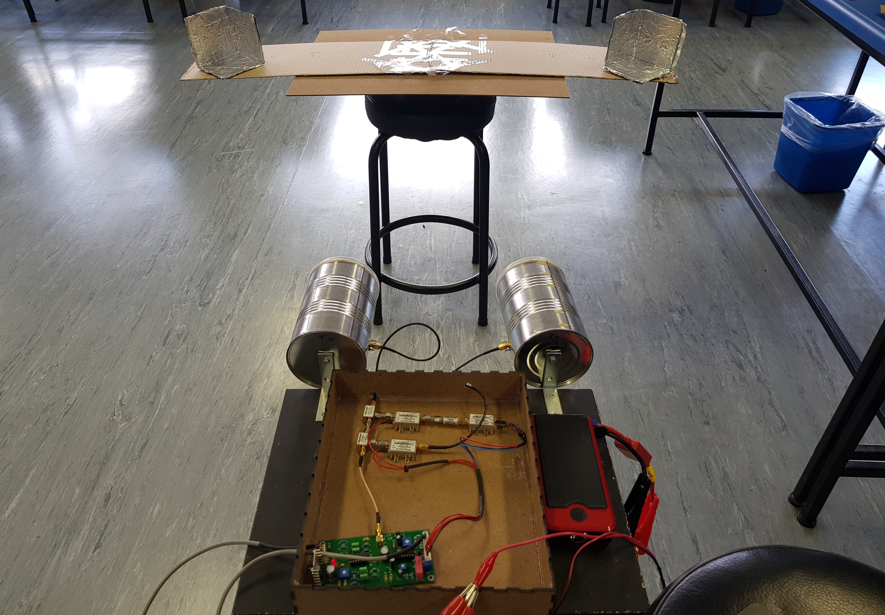
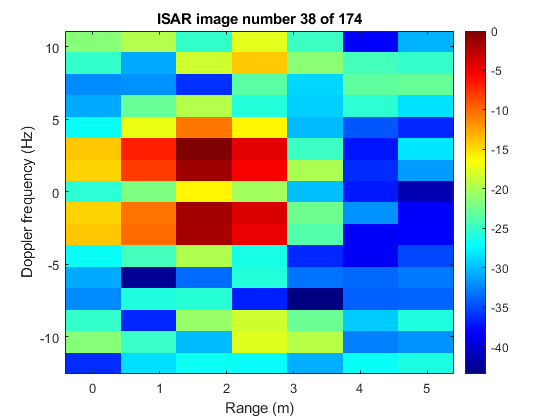

# Evaluating the MIT S-band radar as an educational tool
This code repository contains the code that was written to perform Inverse Synthetic Aperture Radar (ISAR) imaging using the MIT S-band radar in FMCW mode. This was written for the ISAR demonstrator phase of the final year project.

## Abstract:

This project came about from the goal of incorporating the coffee can radar into the Radar masters course at the University of Cape Town, to allow students to collect radar data using a low cost and educational radar. The project was divided into three phases: the first phase involved developing and conducting low frequency subsystem and integration tests to determine whether the radar was functioning correctly. The second phase involved conducting indoor and outdoor experiments to demonstrate the radar’s capabilities to measure target range and velocity. The last phase of the project involved designing an Inverse Synthetic Aperture Radar (ISAR) imaging demonstrator using the radar. It was found that the radar system functioned mostly as expected on a subsystem level. The results from the experiments showed that the radar could measure the speed of targets and distinguish between a human target walking, jogging and sprinting. The maximum range of the radar was found to be between 30 - 50 m for human targets. Lastly, the radar was found capable to be utilised for Inverse Synthetic Aperture Radar imaging in the educational context and was able to generate low-resolution images of corner reflector targets in motion. This addressed a gap in the literature on the use cases of the radar for ISAR imaging. During each phase of the project, it was observed that the radar possessed educational value in terms of electronics, radar applications and system design.

### Radar system design



The coffee can radar



The RF transmit and receive chain

### Experment setup



Two-corner reflector targets positioned 1 meter away from radar, separated in cross-range by 1 meter

### Results



The resulting ISAR image of the two-corner reflector targets

## Repository information:

- mit_radar_isar_processing.m contains the code used for signal processing and ISAR image processing.

- mit_radar_generate_isar_image.m calls mit_radar_isar_processing files and allows a user to import the recorded radar dataset.

- The datasets folder contains sample test data from the dataset that was used.

- The final_code folder contains a modified version of the code that should be run.

- The final_report folder contains the final research report that was written.

## Instructions to run code:

To successfully execute the ISAR image generating code:

1. Open the final_code folder
2. Include your local file path that points to the dataset folder on line 26 in the mit_radar_generate_isar_image.m script, i.e 

   ```
   All_ISAR_wav_recordings = {[filepath,'1_corner_reflectors_1m_downrange_slow.wav]';[filepath,'2_corner_reflectors_1m_downrange_slow.wav']};
   ```

2. Run the script mit_radar_generate_isar_image.m to generate ISAR images in the recorded radar sample dataset.


